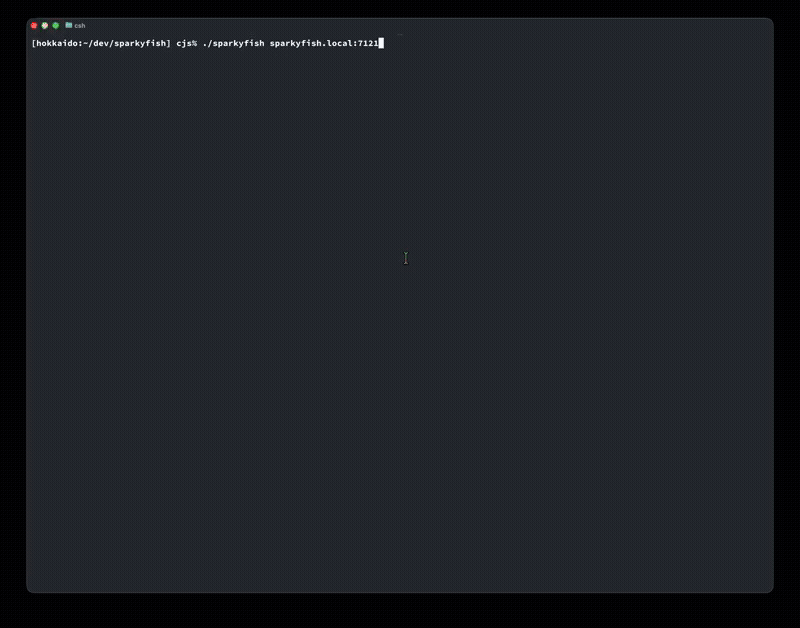

# sparkyfish

An open-source network speed and latency tester with a rich terminal UI. Deploy your own server anywhere and measure real throughput between any two points on your network.



## Why sparkyfish?

- **Run your own speed test servers** -- Ookla's private Speedtest server now costs $5,000+/year. Sparkyfish is free and open source.
- **No artificial limits** -- test at whatever speed your server and client can handle: 1 Gbps, 10 Gbps, or beyond.
- **Rich terminal UI** -- real-time streaming line charts for download, upload, and latency built with [Bubble Tea](https://github.com/charmbracelet/bubbletea) and [ntcharts](https://github.com/NimbleMarkets/ntcharts).
- **No net-neutrality concerns** -- ISPs can't selectively prioritize your test traffic.
- **Simple architecture** -- one static binary for the client, one for the server. No dependencies.
- **Cross-platform** -- Linux, macOS, Windows, FreeBSD, OpenBSD. amd64 and arm64.

## Installing

### Binary releases

Download the latest release from the [Releases](https://github.com/chrissnell/sparkyfish/releases/) page. Packages are available as `.deb`, `.rpm`, and standalone archives.

### Build from source

Requires Go 1.22+:

```
git clone https://github.com/chrissnell/sparkyfish.git
cd sparkyfish
make            # builds both client and server into bin/
make client     # client only
make server     # server only
```

## Running the client

```
sparkyfish <server-hostname>[:port]
```

The default port is `7121`. The client connects, runs latency probes, then measures download and upload throughput, displaying live results in the terminal.

**Keyboard controls:**
- `q` / `Ctrl+C` -- quit
- `r` -- re-run the test (after completion)

The terminal must be at least 60x24 characters.

## Running the server

The server is a single binary that listens for client connections and runs speed tests against them.

```
sparkyfish-server [flags]
```

| Flag | Default | Description |
|------|---------|-------------|
| `-listen-addr` | `:7121` | IP:port to listen on |
| `-cname` | | Canonical hostname reported to clients |
| `-location` | | Physical location displayed to clients |
| `-debug` | `false` | Enable verbose logging |

Make sure port 7121/tcp is open in your firewall.

### systemd

Install the binary to `/usr/bin/sparkyfish-server` (or use the `.deb`/`.rpm` package), then create the unit file:

**/etc/systemd/system/sparkyfish-server.service**
```ini
[Unit]
Description=Sparkyfish speed test server
After=network-online.target
Wants=network-online.target

[Service]
Type=simple
ExecStart=/usr/bin/sparkyfish-server \
    -listen-addr=:7121 \
    -location="Dallas, TX"

# Hardening
DynamicUser=yes
ProtectSystem=strict
ProtectHome=yes
PrivateTmp=yes
PrivateDevices=yes
ProtectKernelTunables=yes
ProtectKernelModules=yes
ProtectKernelLogs=yes
ProtectControlGroups=yes
ProtectClock=yes
ProtectHostname=yes
RestrictAddressFamilies=AF_INET AF_INET6
RestrictNamespaces=yes
RestrictRealtime=yes
RestrictSUIDSGID=yes
LockPersonality=yes
MemoryDenyWriteExecute=yes
NoNewPrivileges=yes
SystemCallArchitectures=native
SystemCallFilter=@system-service
SystemCallFilter=~@privileged @resources

Restart=on-failure
RestartSec=5

[Install]
WantedBy=multi-user.target
```

Enable and start:
```
sudo systemctl daemon-reload
sudo systemctl enable --now sparkyfish-server
```

### Kubernetes (Helm)

A Helm chart is included in `packaging/helm/sparkyfish-server/`.

```
helm install sparkyfish-server ./packaging/helm/sparkyfish-server \
    --set sparkyfish.location="Dallas, TX" \
    --set sparkyfish.cname="speedtest.example.com"
```

Key values:

| Value | Default | Description |
|-------|---------|-------------|
| `sparkyfish.location` | `""` | Physical location shown to clients |
| `sparkyfish.cname` | `""` | Canonical hostname reported to clients |
| `sparkyfish.debug` | `false` | Enable verbose server logging |
| `service.type` | `LoadBalancer` | Kubernetes service type |
| `service.externalTrafficPolicy` | `Local` | Preserves client source IPs |
| `service.annotations` | `{}` | Annotations for MetalLB, etc. |

The deployment runs as non-root with a read-only root filesystem and all capabilities dropped.

### Docker

```
docker run -d -p 7121:7121 ghcr.io/chrissnell/sparkyfish:latest \
    -location="Dallas, TX"
```

Note: Docker networking overhead can reduce throughput accuracy. For production use, prefer running the binary directly or in Kubernetes with `hostNetwork`.

## Protocol

Sparkyfish uses a simple, open TCP protocol on port 7121. See [docs/PROTOCOL.md](docs/PROTOCOL.md) for details. You're welcome to implement your own compatible client or server.

## License

MIT
